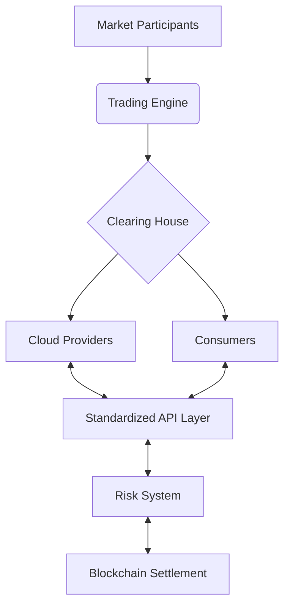
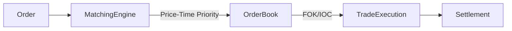

# RFC: Cloud Computing Resource Exchange (CCRE)  
**A Decentralized Marketplace for Cloud Infrastructure**  
**Authors**: Prajna Prayas  
**Date**: 27 January 2025

---

## 1. Abstract
This document proposes a standardized exchange mechanism for cloud computing resources, drawing parallels to electricity markets while addressing unique computational constraints. The system combines:  
- Commoditized IaaS abstraction layer  
- Continuous double-auction market mechanism  
- Cross-cloud API standardization  
- Risk-managed settlement system  

---

## 2. Introduction  
### 2.1 Historical Context  
*"Computing may someday be organized as a public utility"* - John McCarthy (1961)  
The vision of computing-as-utility has evolved through:  
- Time-sharing systems (1960s)  
- Grid computing (1990s)  
- Cloud computing (2000s)  
- Serverless architectures (2010s)  

### 2.2 Modern Opportunity  
Current cloud market inefficiencies:  
| Issue | Current State | CCRE Solution |  
|-------|---------------|---------------|  
| Price Discovery | Opaque pricing | Transparent markets |  
| Resource Mobility | Vendor lock-in | Standardized APIs |  
| Utilization | Average 40% server utilization | Dynamic allocation |  

---

## 3. Architectural Overview  


---

## 4. Market Mechanism Design  
### 4.1 Auction Types  
**Spot Market**:  
- Continuous double auction  
- 30-second price intervals  
- Preemption allowed  

**Forward Market**:  
- Day-ahead commitment  
- Financial transmission rights  

### 4.2 Matching Algorithm  


### 4.3 Pricing Model  
Hybrid approach combining:  
- **VCG Mechanism** (Truthfulness)  
- **Mid-Price Spread** (Liquidity)  
- **ARIMA Forecasting** (Price signals)  

---

## 5. Cross-Cloud Standardization  
### 5.1 API Taxonomy  
| Layer | Standard | Example |  
|-------|----------|---------|  
| Authentication | OAuth2.0 | Unified token |  
| Compute | CIMI Lite | Instance object |  
| Storage | CDMI Lite | Bucket interface |  
| Network | NaaS 1.0 | Virtual router |  

### 5.2 Compatibility Matrix  
| Feature | AWS | Hetzner | GCP |  
|---------|-----|---------|-----|  
| vCPU Unit | 1:1 | 1:0.95 | 1:1.1 |  
| RAM Pricing | $0.05/GB | $0.04/GB | $0.055/GB |  
| Storage SLA | 99.99% | 99.95% | 99.99% |  

---

## 6. Risk Management Framework  
### 6.1 Key Components  
- **Margin Calculator**:  
  ```math 
  Initial Margin = σ(Price) × √(HoldingPeriod) × Quantile(99%)
  ```  
- **Circuit Breakers**:  
  ```python
  if price_change > 15% in 5min:
      halt_trading(300sec)
  ```  
- **SLA Insurance Pool**:  
  Crowdfunded downtime protection  

---

## 7. Implementation Roadmap  
**Phase 1 (Q1-Q2 2024)**:  
- Core matching engine (Go)  
- Hetzner/AWS adapters  
- Basic spot market  

**Phase 2 (Q3 2024)**:  
- FaaS layer standardization  
- Forward market contracts  
- Cross-cloud migration  

**Phase 3 (2025)**:  
- AI-powered arbitrage bots  
- Quantum-resistant settlement  
- Edge computing integration  

---

## 8. Academic Foundations  
### 8.1 Key Papers  
1. **Market Design**:  
   - "The Theory of Auctions" (Milgrom, 1981)  
   - "Combinatorial Auctions" (Cramton, 2006)  

2. **Cloud Economics**:  
   - "A Market-Oriented Grid" (Buyya, 2002)  
   - "Intercloud Architecture" (Bernstein, 2010)  

3. **Risk Management**:  
   - "Value at Risk" (Jorion, 1996)  
   - "HFT Risk Controls" (Aldridge, 2013)  

### 8.2 Historical Precedents  
- California Power Exchange (1998-2001)  
- AWS Spot Market (2009-Present)  
- Alibaba Cloud Spot (2016-Present)  

---

## 9. Stakeholder Impact Analysis  
| Group | Benefit | Risk |  
|-------|---------|------|  
| Cloud Providers | Increased utilization | Price competition |  
| Enterprises | Cost optimization | Operational complexity |  
| Regulators | Market transparency | Systemic risk |  
| Developers | Portable workloads | Learning curve |  

---

## 10. Conclusion & Next Steps  
This RFC proposes a radical rethinking of cloud infrastructure markets through:  
1. Financial market-inspired trading mechanisms  
2. Strong API standardization efforts  
3. Hybrid centralized/decentralized governance  

**Immediate Actions**:  
1. Form technical steering committee  
2. Develop MVP with Hetzner integration  
3. Establish academic partnerships  

---

## Appendices  
**A. Glossary**  
**B. Reference Implementation**  
**C. Regulatory Considerations**  
**D. Security Audit Plan**  

